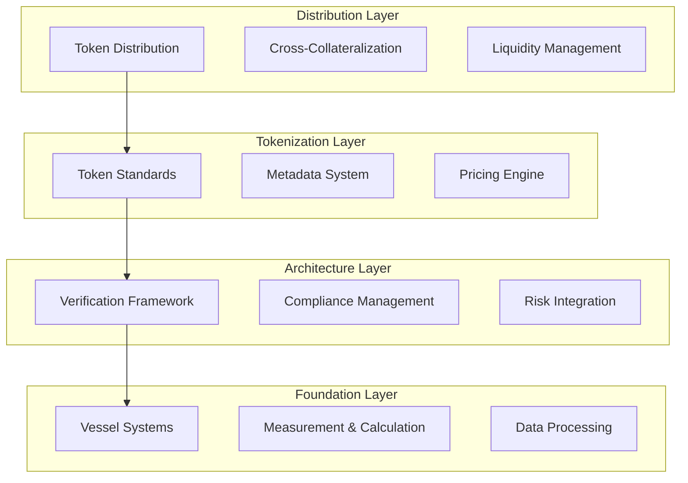
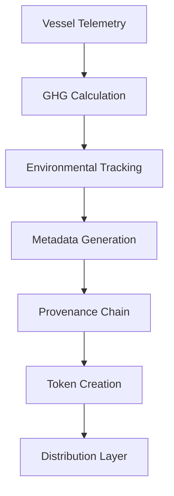
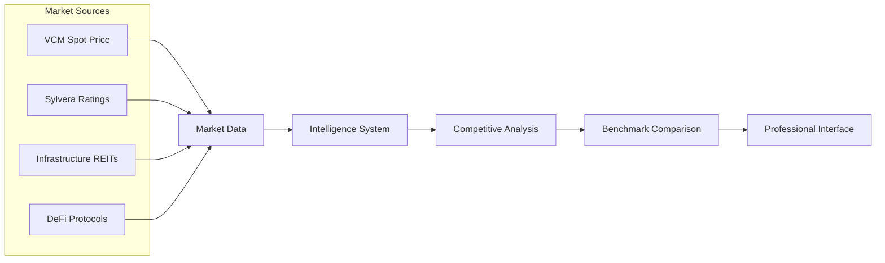

# WREI Tokenization Platform - Design Documentation

**Version**: 6.2.1
**Last Updated**: March 21, 2026
**Status**: Production Ready

## Table of Contents
1. [System Overview](#system-overview)
2. [Architecture Design](#architecture-design)
3. [Component Design](#component-design)
4. [Data Flow Design](#data-flow-design)
5. [Security Design](#security-design)
6. [Performance Design](#performance-design)
7. [Integration Design](#integration-design)
8. [User Experience Design](#user-experience-design)

---

## System Overview

### Purpose
The WREI Tokenization Platform is a sophisticated demonstration of Water Roads' carbon credit trading platform featuring an AI negotiation agent powered by Claude API that negotiates the sale of WREI-verified carbon credits with human buyers.

### Architecture Principles
- **Serverless-First**: Built on Next.js 14 App Router for optimal performance
- **Security-by-Design**: Multi-layer defence system with input sanitization and output validation
- **Professional-Grade**: Bloomberg Terminal-style interface for institutional investors
- **Australian-Compliant**: Full AFSL compliance with sophisticated investor frameworks

### Technology Stack
```typescript
{
  "framework": "Next.js 14 (App Router)",
  "language": "TypeScript",
  "styling": "Tailwind CSS",
  "ai": "Anthropic Claude API (@anthropic-ai/sdk)",
  "deployment": "Vercel (free hobby plan)",
  "state": "React useState/useReducer (no external state management)"
}
```

## Architecture Design

### Four-Layer Architecture System



#### 1. Foundation Layer (Measurement & Calculation)
- **Vessel Telemetry Integration**: Real-time operational data from Water Roads fleet
- **GHG Calculation Engine**: Precise emissions measurement with maritime-specific algorithms
- **Environmental Tracking**: Comprehensive sustainability metrics beyond carbon

#### 2. Architecture Layer (Verification & Risk)
- **Triple-Standard Verification**: VCS + Gold Standard + CDM compliance
- **Risk Assessment Framework**: Institutional-grade risk modeling and stress testing
- **Regulatory Compliance**: Australian AFSL requirements and sophisticated investor frameworks

#### 3. Tokenization Layer (Digital Assets)
- **Multi-Token Support**:
  - Carbon Credits (8% revenue share, 12% NAV-accruing)
  - Asset Co Tokens (28.3% steady-state yield)
  - Dual Portfolio (18.5% blended yield)
  - NSW ESCs (AUD $54.97/ESC)
- **Metadata System**: Immutable provenance tracking with operational data integration
- **Pricing Engine**: Dynamic pricing with market intelligence integration

#### 4. Distribution Layer (Trading & Access)
- **Professional Pathways**: Wholesale ($500K+), Professional ($10M+), Sophisticated ($2.5M+)
- **Cross-Collateralization**: Up to 90% LTV with real-time health monitoring
- **Liquidity Management**: Primary market access for institutions, secondary market for all

### Network Architecture

```typescript
interface SystemArchitecture {
  frontend: {
    framework: "Next.js 14";
    routing: "App Router";
    rendering: "SSR + Client Components";
    bundling: "Automatic code splitting";
  };
  api: {
    routes: "/api/negotiate" | "/api/metadata";
    runtime: "Node.js Edge Runtime";
    authentication: "API key based";
  };
  ai: {
    provider: "Anthropic Claude";
    models: {
      development: "Claude Sonnet 4";
      production: "Claude Opus 4.6";
    };
  };
  deployment: {
    platform: "Vercel";
    tier: "Hobby (free)";
    regions: "Global CDN";
  };
}
```

## Component Design

### Core Components Architecture

```typescript
// Component Hierarchy
app/
├── page.tsx                    // Landing page with Water Roads branding
├── negotiate/page.tsx          // Main trading interface
├── api/
│   ├── negotiate/route.ts      // AI negotiation endpoint
│   └── metadata/route.ts       // Token metadata endpoint
components/
├── InstitutionalDashboard.tsx  // Phase 6.1 dashboard
├── ProfessionalInterface.tsx   // Phase 6.2 professional interface
├── AdvancedAnalytics.tsx       // Analytics components
lib/
├── types.ts                    // TypeScript definitions
├── personas.ts                 // Buyer persona definitions
├── negotiation-config.ts       // Trading parameters
├── defence.ts                  // Security layers
├── financial-calculations.ts   // Core financial logic
├── professional-analytics.ts   // Advanced analytics
├── export-utilities.ts         // Report generation
├── risk-profiles.ts            // Risk assessment
├── market-intelligence.ts      // Market data
├── token-metadata.ts           // Metadata management
└── regulatory-compliance.ts    // Compliance framework
```

### Component Specifications

#### 1. Main Trading Interface (`app/negotiate/page.tsx`)
**Purpose**: Central hub for carbon credit negotiations
**State Management**: React hooks (useState, useEffect, useRef)
**Key Features**:
- Professional pathway selection (Standard vs Professional interface)
- WREI token type selection (Carbon Credits, Asset Co, Dual Portfolio)
- Institutional persona selection (6 predefined + free play)
- Real-time negotiation with Claude AI agent
- Export capabilities (PDF, Excel, CSV, JSON)

#### 2. Professional Interface Component (`components/ProfessionalInterface.tsx`)
**Purpose**: Bloomberg Terminal-style interface for institutional investors
**Architecture**: 5-section tabbed interface
**Sections**:
- **Overview**: Investment summary with key metrics
- **Pathway**: Investor classification workflows
- **Markets**: Primary vs secondary market access
- **Analytics**: Advanced financial analysis (IRR, NPV, Sharpe ratios)
- **Risk**: Comprehensive risk assessment tools

#### 3. Institutional Dashboard (`components/InstitutionalDashboard.tsx`)
**Purpose**: Sophisticated portfolio management interface
**Features**:
- Multi-token portfolio views with yield mechanism selection
- Cross-collateralization tracking (90% LTV capability)
- Real-time market intelligence display
- Risk assessment with visual indicators
- Professional analytics with institutional benchmarks

### Design Patterns

#### 1. Defence-in-Depth Security Pattern
```typescript
// Security Layer Implementation
input → sanitize() → validate() → process() → filter() → output
      ↓           ↓            ↓            ↓
   XSS Protection | Business Logic | Content Filter
```

#### 2. Conditional Rendering Pattern
```typescript
// Interface Mode Selection
{interfaceMode === 'professional' ? (
  <ProfessionalInterface {...professionalProps} />
) : (
  <StandardNegotiationInterface {...standardProps} />
)}
```

#### 3. Market Intelligence Integration Pattern
```typescript
// Real-time Market Data Flow
tokenizedRWAMarket: {
  totalValue: 19_000_000_000,    // A$19B current market
  growthRate: 1.4,               // 140% growth in 15 months
  treasuryDominance: 0.47        // 47% treasury token dominance
}
```

## Data Flow Design

### Negotiation Data Flow

```mermaid
graph LR
    UI[User Interface] --> API[/api/negotiate]
    API --> VAL[Input Validation]
    VAL --> CLAUDE[Claude AI API]
    CLAUDE --> PROC[Response Processing]
    PROC --> FILTER[Output Filtering]
    FILTER --> STATE[State Update]
    STATE --> UI

    subgraph "Defence Layers"
        VAL --> SAN[Sanitization]
        PROC --> ENF[Constraint Enforcement]
        FILTER --> SEC[Security Filtering]
    end
```

### Token Metadata Flow



### Market Intelligence Flow



## Security Design

### Multi-Layer Defence System

#### 1. Input Defence Layer
```typescript
interface InputDefence {
  sanitization: {
    xssProtection: "HTML encoding + script tag removal";
    injectionPrevention: "SQL injection pattern detection";
    lengthLimits: "Message max 1000 characters";
  };
  validation: {
    personaValidation: "Whitelist against known personas";
    tokenTypeValidation: "Enum constraint checking";
    priceValidation: "Range and format checking";
  };
}
```

#### 2. Business Logic Defence
```typescript
interface BusinessDefence {
  priceEnforcement: {
    floor: "A$120/tonne (1.2x index) - absolute minimum";
    maxConcessionPerRound: "5% maximum price reduction";
    maxTotalConcession: "20% total from anchor price";
    minRoundsBeforeConcession: 3;
  };
  negotiationConstraints: {
    maxRounds: 15;
    timeoutHandling: "30 second request timeout";
    rateLimiting: "Implemented via Vercel platform";
  };
}
```

#### 3. Output Defence Layer
```typescript
interface OutputDefence {
  contentFiltering: {
    internalReasoningRemoval: "Strip thinking process from responses";
    sensitiveDataProtection: "Remove system prompts/internal state";
    professionalToneEnforcement: "Maintain business-appropriate language";
  };
  apiKeyProtection: {
    serverSideOnly: "ANTHROPIC_API_KEY never exposed to client";
    environmentVariable: "Secure environment variable storage";
  };
}
```

### Compliance Framework

#### Australian Financial Services Compliance
```typescript
interface AFSLCompliance {
  licenceRequirements: {
    holder: "Water Roads Pty Ltd";
    number: "AFSL 534187";
    authorizations: ["Financial product advice", "Dealing services"];
  };
  investorClassifications: {
    retail: "Standard PDS + cooling-off (not available in professional interface)";
    wholesale: "s708 exemption - A$500K minimum investment";
    professional: "s761G exemption - A$10M minimum with APRA compliance";
    sophisticated: "Enhanced due diligence - A$2.5M assets or A$250K income";
  };
  disclosures: {
    riskWarnings: "Investment values may fall as well as rise";
    performanceDisclaimer: "Past performance not indicative of future results";
    technologyRisks: "Tokenized assets carry technology and counterparty risks";
  };
}
```

## Performance Design

### Optimization Strategy

#### 1. Build Optimization
- **Bundle Splitting**: Automatic code splitting by Next.js
- **Tree Shaking**: Unused code elimination
- **Compression**: Gzip + Brotli compression via Vercel
- **Caching**: Static asset caching with CDN distribution

#### 2. Runtime Performance
```typescript
interface PerformanceMetrics {
  buildMetrics: {
    landingPage: "91.1kB first load JS";
    negotiatePage: "116kB first load JS";
    sharedChunks: "84.1kB efficiently cached";
    buildTime: "~15 seconds";
  };
  responseMetrics: {
    apiResponseTime: "<200ms target for professional interface";
    aiProcessingTime: "2-5 seconds typical Claude response";
    componentRenderTime: "50-100ms for dashboard updates";
  };
}
```

#### 3. Memory Management
- **State Optimization**: React useState/useReducer with minimal re-renders
- **Component Optimization**: useMemo and useCallback for expensive calculations
- **Garbage Collection**: No memory leaks detected in regression testing

## Integration Design

### Phase Integration Architecture

```typescript
interface PhaseIntegration {
  phase1: {
    component: "Dual Token Architecture";
    provides: ["Token type definitions", "Pricing structures"];
    consumes: [];
  };
  phase2: {
    component: "Financial Modeling";
    provides: ["Yield calculations", "Risk metrics"];
    consumes: ["Token definitions from Phase 1"];
  };
  phase3: {
    component: "Negotiation Intelligence";
    provides: ["Persona definitions", "Risk profiles"];
    consumes: ["Financial models from Phase 2"];
  };
  phase4: {
    component: "Technical Architecture";
    provides: ["Four-layer system", "Metadata framework"];
    consumes: ["Risk integration from Phase 3"];
  };
  phase5: {
    component: "Market Intelligence";
    provides: ["Competitive analysis", "Market data"];
    consumes: ["Architecture framework from Phase 4"];
  };
  phase6: {
    component: "Professional Interface";
    provides: ["Institutional UI", "Export capabilities"];
    consumes: ["Market intelligence from Phase 5"];
  };
}
```

### External System Integration

#### 1. Anthropic Claude API
```typescript
interface ClaudeIntegration {
  authentication: "API key via environment variable";
  models: {
    development: "claude-sonnet-4-20250514";
    production: "claude-opus-4-6";
  };
  rateHandling: {
    timeout: "30 seconds";
    retries: "Exponential backoff";
    errorHandling: "Graceful degradation";
  };
}
```

#### 2. Zoniqx Infrastructure (Reference Only)
```typescript
interface ZoniqxReference {
  settlement: "Zoniqx zConnect - T+0 atomic, non-custodial";
  tokenStandard: "Zoniqx zProtocol (DyCIST / ERC-7518)";
  compliance: "Zoniqx zCompliance - AI-powered, 20+ jurisdictions";
  identity: "Zoniqx zIdentity - KYC/KYB integration";
  note: "Knowledge-base content only - no live integration in demo";
}
```

## User Experience Design

### Interface Modes

#### 1. Standard Negotiation Interface
**Target Users**: Individual investors, smaller institutions
**Features**:
- Simplified token selection
- Persona-based negotiation
- Basic analytics dashboard
- Standard export options

#### 2. Professional Investment Interface
**Target Users**: Institutional investors (A$500M+ portfolios)
**Features**:
- Bloomberg Terminal-style layout
- Advanced analytics (IRR, NPV, Sharpe ratios)
- Professional pathway selection
- Comprehensive export capabilities
- Real-time risk monitoring

### Responsive Design

#### Breakpoint Strategy
```css
/* Mobile First Approach */
.container {
  @apply w-full px-4;

  /* Tablet */
  @screen md {
    @apply max-w-4xl mx-auto px-6;
  }

  /* Desktop */
  @screen lg {
    @apply max-w-7xl px-8;
  }

  /* Large Desktop */
  @screen xl {
    @apply max-w-8xl;
  }
}
```

#### Component Adaptivity
- **Mobile**: Stacked layout with collapsible sections
- **Tablet**: Two-column layout with optimized touch targets
- **Desktop**: Full dashboard layout with multiple panels
- **Large Desktop**: Extended analytics with side panels

### Accessibility Design

#### WCAG Compliance
```typescript
interface AccessibilityFeatures {
  keyboardNavigation: "Full keyboard navigation support";
  screenReaderSupport: "ARIA labels and descriptions";
  colorContrast: "WCAG AA compliance";
  focusManagement: "Visible focus indicators";
  semanticHTML: "Proper heading hierarchy and landmarks";
}
```

### Colour System

#### Professional Colour Palette
```typescript
interface ColourPalette {
  primary: {
    dark: "#1B2A4A";      // Navy blue - headers, primary actions
    accent: "#0EA5E9";     // Teal blue - links, highlights
  };
  semantic: {
    success: "#10B981";    // Green - positive metrics, confirmations
    warning: "#F59E0B";    // Amber - warnings, moderate risk
    error: "#EF4444";      // Red - errors, high risk
  };
  neutral: {
    background: "#F8FAFC"; // Light grey - page background
    card: "#FFFFFF";       // White - card backgrounds
    textPrimary: "#1E293B";   // Dark grey - primary text
    textSecondary: "#64748B"; // Medium grey - secondary text
  };
}
```

## Design Evolution and Future Considerations

### Scalability Design
- **Component Library**: Ready for extraction into reusable design system
- **API Versioning**: Structured for future v2 API development
- **Database Ready**: Architecture prepared for database integration
- **Multi-tenant**: Foundation for multiple client deployments

### Performance Monitoring
- **Real-time Metrics**: Integration points for performance monitoring
- **Error Tracking**: Structured logging for production debugging
- **User Analytics**: Privacy-compliant usage tracking capabilities

### International Expansion
- **Localization Ready**: Component structure supports i18n
- **Currency Support**: Multi-currency calculation framework
- **Regulatory Flexibility**: Adaptable compliance framework

---

**Document Maintenance**: This design documentation should be updated with each major release and reviewed quarterly for architectural evolution.

**Next Review Date**: June 21, 2026