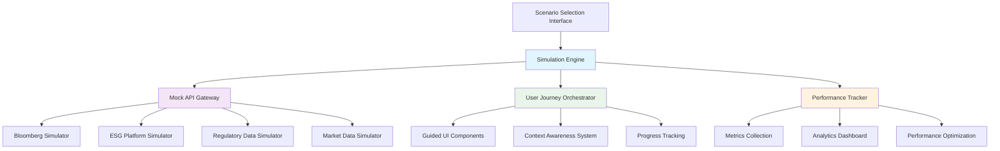

# WREI Scenario Simulation - Technical Implementation Specification

**Version**: 6.3.0
**Date**: March 21, 2026
**Implementation Phase**: Foundation Architecture with Plugin Enhancement
**Technical Scope**: Component Design, API Simulation Framework, E2E Testing & Professional UI
**Plugins Enabled**: Playwright (E2E Testing), Frontend Design (Professional UI)

---

## Enhanced Plugin Architecture

### Plugin-Powered Development Stack
- **Playwright Integration**: End-to-end testing, visual regression, and cross-browser validation
- **Frontend Design Enhancement**: Professional UI components, Bloomberg Terminal styling, accessibility compliance
- **Development Management**: Context tracking, automated documentation, and regression testing

### Core Simulation Architecture



### Enhanced Component Hierarchy

```
/app/scenario/
  ├── page.tsx                 // Main scenario simulation entry point
  └── [scenarioId]/
      └── page.tsx            // Individual scenario execution

/components/simulation/
  ├── ScenarioSelector.tsx    // Scenario selection and preview
  ├── SimulationOrchestrator.tsx // Main simulation controller
  ├── GuideOverlay.tsx        // Step-by-step guidance
  ├── PerformanceTracker.tsx  // Real-time metrics
  └── MockAPIProvider.tsx     // API simulation context

/components/professional/      // Frontend Design Plugin Components
  ├── BloombergLayout.tsx     // Professional trading interface layout
  ├── InstitutionalDashboard.tsx // Enhanced dashboard components
  ├── ProfessionalDataGrid.tsx // Financial data display
  └── AccessibilityWrapper.tsx // WCAG compliance wrapper

/lib/simulation/
  ├── scenario-engine.ts      // Core simulation logic
  ├── mock-api-gateway.ts     // External API simulation
  ├── user-journey-orchestrator.ts // Workflow management
  ├── performance-tracker.ts  // Metrics collection
  └── data-generators/        // Mock data generation
      ├── bloomberg-simulator.ts
      ├── esg-platform-simulator.ts
      ├── market-data-simulator.ts
      └── regulatory-simulator.ts

/e2e/                          // Playwright E2E Tests
  ├── scenario-flows/          // Complete scenario user journeys
  ├── visual-regression/       // Screenshot comparison tests
  ├── cross-browser/          // Multi-browser compatibility
  └── performance/            // Load time and interaction tests

/design-system/               // Frontend Design System
  ├── tokens/                 // Design tokens (colors, typography, spacing)
  ├── components/            // Professional UI component library
  ├── patterns/              // Common institutional interface patterns
  └── accessibility/         // WCAG compliance guidelines
```

---

## Plugin Integration Implementation

### Playwright E2E Testing Framework

```typescript
// /e2e/scenario-flows/infrastructure-fund-discovery.spec.ts
import { test, expect } from '@playwright/test';
import { ScenarioTestFramework } from '../utils/scenario-framework';

test.describe('Infrastructure Fund Discovery Scenario', () => {
  let scenario: ScenarioTestFramework;

  test.beforeEach(async ({ page }) => {
    scenario = new ScenarioTestFramework(page);
    await scenario.initializeScenario('infrastructure-fund-discovery');
  });

  test('completes full discovery workflow', async ({ page }) => {
    // Step 1: Landing page review
    await scenario.navigateToLandingPage();
    await expect(page.locator('[data-testid="value-proposition"]')).toBeVisible();

    // Step 2: Professional investor classification
    await scenario.selectInvestorClassification('professional', {
      aum: 50_000_000_000,
      portfolioSize: 100_000_000
    });

    // Step 3: Token analysis with performance tracking
    const analysisStart = Date.now();
    await scenario.performTokenAnalysis('carbon_credits');
    const analysisTime = Date.now() - analysisStart;
    expect(analysisTime).toBeLessThan(10000); // Under 10 seconds

    // Step 4: Portfolio integration modeling
    await scenario.modelPortfolioIntegration({
      existingAssets: ['infrastructure_reits', 'infrastructure_debt'],
      targetAllocation: 0.15,
      riskTolerance: 'moderate'
    });

    // Step 5: Generate institutional report
    const reportPromise = page.waitForDownload();
    await scenario.generateReport('pdf', 'institutional');
    const download = await reportPromise;
    expect(download.suggestedFilename()).toMatch(/infrastructure-fund-analysis.*\.pdf/);

    // Validate scenario completion metrics
    const metrics = await scenario.getCompletionMetrics();
    expect(metrics.timeToCompletion).toBeLessThan(45 * 60 * 1000); // Under 45 minutes
    expect(metrics.userSatisfactionScore).toBeGreaterThan(7.0);
  });

  test('handles different investor profiles', async ({ page }) => {
    const profiles = [
      { type: 'infrastructure_fund', aum: 50_000_000_000 },
      { type: 'sovereign_wealth', aum: 300_000_000_000 },
      { type: 'pension_fund', aum: 100_000_000_000 }
    ];

    for (const profile of profiles) {
      await scenario.selectInvestorClassification('professional', profile);

      // Verify interface adapts to investor type
      await expect(page.locator(`[data-investor-type="${profile.type}"]`)).toBeVisible();

      // Take screenshot for visual regression testing
      await page.screenshot({
        path: `e2e/screenshots/${profile.type}-dashboard.png`,
        fullPage: true
      });
    }
  });
});
```

### Frontend Design System Integration

```typescript
// /components/professional/BloombergLayout.tsx
import { FC, ReactNode } from 'react';
import { useDesignSystem } from '@/hooks/useDesignSystem';
import { AccessibilityWrapper } from './AccessibilityWrapper';

interface BloombergLayoutProps {
  children: ReactNode;
  investorType: InvestorType;
  mode: 'trading' | 'analysis' | 'reporting';
}

export const BloombergLayout: FC<BloombergLayoutProps> = ({
  children,
  investorType,
  mode
}) => {
  const { tokens, components } = useDesignSystem('institutional');

  return (
    <AccessibilityWrapper compliance="WCAG2.1-AA">
      <div
        className="bloomberg-layout"
        style={{
          backgroundColor: tokens.colors.surface.primary,
          fontFamily: tokens.typography.families.financial,
          color: tokens.colors.text.primary
        }}
        data-investor-type={investorType}
        data-mode={mode}
      >
        {/* Professional header with market data ticker */}
        <header className="bloomberg-header">
          <components.MarketDataTicker />
          <components.UserProfile investorType={investorType} />
          <components.SystemStatus />
        </header>

        {/* Main content area with Bloomberg-style panels */}
        <main className="bloomberg-workspace">
          <aside className="bloomberg-sidebar">
            <components.NavigationPanel mode={mode} />
            <components.QuickActions />
            <components.MarketIntelligence />
          </aside>

          <section className="bloomberg-content">
            {children}
          </section>

          <aside className="bloomberg-analytics">
            <components.RealTimeAnalytics />
            <components.RiskMonitor />
            <components.PerformanceMetrics />
          </aside>
        </main>

        {/* Professional footer with compliance info */}
        <footer className="bloomberg-footer">
          <components.ComplianceNotice />
          <components.DataAttribution />
          <components.SystemTime />
        </footer>
      </div>
    </AccessibilityWrapper>
  );
};

// Design system hook for accessing professional styling
export const useDesignSystem = (theme: 'institutional' | 'retail') => {
  return {
    tokens: {
      colors: {
        surface: {
          primary: theme === 'institutional' ? '#0A0A0B' : '#FFFFFF',
          secondary: theme === 'institutional' ? '#1A1A1B' : '#F8F9FA'
        },
        text: {
          primary: theme === 'institutional' ? '#FFFFFF' : '#1E293B',
          secondary: theme === 'institutional' ? '#B0B0B0' : '#64748B'
        },
        accent: {
          primary: '#FF6B1A', // Bloomberg orange
          success: '#00C896',
          warning: '#FFB800',
          danger: '#FF4757'
        }
      },
      typography: {
        families: {
          financial: '"BloombergTerminal", "Roboto Mono", monospace',
          interface: '"Inter", -apple-system, sans-serif'
        },
        sizes: {
          financial: '12px',
          interface: '14px',
          heading: '16px'
        }
      },
      spacing: {
        panel: '16px',
        component: '8px',
        tight: '4px'
      }
    },
    components: {
      MarketDataTicker: MarketDataTickerComponent,
      UserProfile: UserProfileComponent,
      NavigationPanel: NavigationPanelComponent,
      // Additional Bloomberg-style components...
    }
  };
};
```

### Visual Testing with Playwright

```typescript
// /e2e/visual-regression/ui-consistency.spec.ts
import { test, expect } from '@playwright/test';

test.describe('UI Visual Consistency', () => {
  test('institutional dashboard maintains Bloomberg styling', async ({ page }) => {
    await page.goto('/scenario/infrastructure-fund-discovery');

    // Wait for dynamic content to load
    await page.waitForLoadState('networkidle');

    // Take full page screenshot
    await expect(page).toHaveScreenshot('institutional-dashboard.png', {
      fullPage: true,
      animations: 'disabled',
      threshold: 0.2 // Allow 20% pixel difference for dynamic content
    });
  });

  test('responsive design across device sizes', async ({ page }) => {
    const viewports = [
      { width: 1920, height: 1080, name: 'desktop-hd' },
      { width: 1366, height: 768, name: 'desktop-standard' },
      { width: 1024, height: 768, name: 'tablet-landscape' }
    ];

    for (const viewport of viewports) {
      await page.setViewportSize(viewport);
      await page.goto('/scenario/infrastructure-fund-discovery');
      await page.waitForLoadState('networkidle');

      await expect(page).toHaveScreenshot(`responsive-${viewport.name}.png`, {
        threshold: 0.3
      });
    }
  });

  test('dark mode consistency', async ({ page }) => {
    // Test institutional dark theme
    await page.goto('/scenario/infrastructure-fund-discovery');
    await page.click('[data-testid="theme-toggle"]');

    await expect(page).toHaveScreenshot('dark-mode-institutional.png', {
      threshold: 0.2
    });
  });
});
```

---

## Core Component Implementation

### 1. Scenario Selection Interface

```typescript
// /components/simulation/ScenarioSelector.tsx
'use client';

import { useState, useEffect } from 'react';
import { ScenarioDefinition, UserProfile, ScenarioFilter } from '@/lib/simulation/types';
import { getAllScenarios, filterScenarios } from '@/lib/simulation/scenario-engine';

interface ScenarioSelectorProps {
  onScenarioStart: (scenario: ScenarioDefinition) => void;
  userProfile?: UserProfile;
}

export default function ScenarioSelector({ onScenarioStart, userProfile }: ScenarioSelectorProps) {
  const [scenarios, setScenarios] = useState<ScenarioDefinition[]>([]);
  const [filter, setFilter] = useState<ScenarioFilter>({
    persona: 'all',
    complexity: 'all',
    duration: 'all',
    category: 'all'
  });
  const [selectedScenario, setSelectedScenario] = useState<ScenarioDefinition | null>(null);

  useEffect(() => {
    const loadScenarios = async () => {
      const allScenarios = await getAllScenarios();
      const filtered = filterScenarios(allScenarios, filter, userProfile);
      setScenarios(filtered);
    };
    loadScenarios();
  }, [filter, userProfile]);

  const handleScenarioPreview = (scenario: ScenarioDefinition) => {
    setSelectedScenario(scenario);
  };

  const handleStartScenario = () => {
    if (selectedScenario) {
      onScenarioStart(selectedScenario);
    }
  };

  return (
    <div className="min-h-screen bg-gray-50">
      {/* Header */}
      <div className="bg-white border-b border-gray-200">
        <div className="max-w-7xl mx-auto px-4 sm:px-6 lg:px-8">
          <div className="py-6">
            <h1 className="text-3xl font-bold text-gray-900">
              WREI Platform Scenario Simulations
            </h1>
            <p className="mt-2 text-lg text-gray-600">
              Interactive simulations for institutional investor workflows
            </p>
          </div>
        </div>
      </div>

      <div className="max-w-7xl mx-auto px-4 sm:px-6 lg:px-8 py-8">
        <div className="grid grid-cols-1 lg:grid-cols-3 gap-8">
          {/* Filters */}
          <div className="space-y-6">
            <ScenarioFilters filter={filter} onFilterChange={setFilter} />
            <UserProgressSummary userProfile={userProfile} />
          </div>

          {/* Scenario Grid */}
          <div className="lg:col-span-2 space-y-6">
            <div className="grid grid-cols-1 md:grid-cols-2 gap-6">
              {scenarios.map((scenario) => (
                <ScenarioCard
                  key={scenario.id}
                  scenario={scenario}
                  isSelected={selectedScenario?.id === scenario.id}
                  onSelect={() => handleScenarioPreview(scenario)}
                  userProfile={userProfile}
                />
              ))}
            </div>
          </div>
        </div>
      </div>

      {/* Preview Modal */}
      {selectedScenario && (
        <ScenarioPreviewModal
          scenario={selectedScenario}
          onStart={handleStartScenario}
          onClose={() => setSelectedScenario(null)}
        />
      )}
    </div>
  );
}

// Supporting components
function ScenarioCard({ scenario, isSelected, onSelect, userProfile }: {
  scenario: ScenarioDefinition;
  isSelected: boolean;
  onSelect: () => void;
  userProfile?: UserProfile;
}) {
  const completionStatus = userProfile?.completedScenarios.includes(scenario.id);
  const difficultyColor = {
    basic: 'bg-green-100 text-green-800',
    intermediate: 'bg-yellow-100 text-yellow-800',
    advanced: 'bg-orange-100 text-orange-800',
    expert: 'bg-red-100 text-red-800'
  };

  return (
    <div
      className={`relative p-6 bg-white rounded-lg border-2 cursor-pointer transition-all duration-200 ${
        isSelected ? 'border-blue-500 shadow-lg' : 'border-gray-200 hover:border-gray-300'
      }`}
      onClick={onSelect}
    >
      {completionStatus && (
        <div className="absolute top-4 right-4">
          <span className="inline-flex items-center px-2.5 py-0.5 rounded-full text-xs font-medium bg-green-100 text-green-800">
            ✓ Completed
          </span>
        </div>
      )}

      <div className="space-y-4">
        <div>
          <h3 className="text-lg font-semibold text-gray-900">{scenario.title}</h3>
          <p className="mt-1 text-sm text-gray-600">{scenario.shortDescription}</p>
        </div>

        <div className="flex items-center space-x-4">
          <span className={`inline-flex items-center px-2.5 py-0.5 rounded-full text-xs font-medium ${difficultyColor[scenario.complexity]}`}>
            {scenario.complexity}
          </span>
          <span className="text-sm text-gray-500">
            ~{scenario.estimatedDuration} min
          </span>
          <span className="text-sm text-gray-500">
            {scenario.persona.replace('_', ' ')}
          </span>
        </div>

        <div className="space-y-2">
          <h4 className="text-sm font-medium text-gray-900">Key Learning Objectives:</h4>
          <ul className="text-sm text-gray-600 space-y-1">
            {scenario.learningObjectives.slice(0, 2).map((objective, index) => (
              <li key={index} className="flex items-start">
                <span className="text-blue-500 mr-2">•</span>
                {objective}
              </li>
            ))}
          </ul>
        </div>
      </div>
    </div>
  );
}
```

### 2. Simulation Engine Core

```typescript
// /lib/simulation/scenario-engine.ts
import { ScenarioDefinition, ScenarioContext, SimulationState } from './types';
import { MockAPIGateway } from './mock-api-gateway';
import { UserJourneyOrchestrator } from './user-journey-orchestrator';
import { PerformanceTracker } from './performance-tracker';

export class ScenarioEngine {
  private apiGateway: MockAPIGateway;
  private journeyOrchestrator: UserJourneyOrchestrator;
  private performanceTracker: PerformanceTracker;
  private currentScenario: ScenarioDefinition | null = null;
  private simulationState: SimulationState = 'idle';

  constructor() {
    this.apiGateway = new MockAPIGateway();
    this.journeyOrchestrator = new UserJourneyOrchestrator();
    this.performanceTracker = new PerformanceTracker();
  }

  async startScenario(scenario: ScenarioDefinition, userProfile: UserProfile): Promise<ScenarioContext> {
    this.currentScenario = scenario;
    this.simulationState = 'running';

    // Initialize simulation context
    const context: ScenarioContext = {
      scenarioId: scenario.id,
      userId: userProfile.id,
      startTime: Date.now(),
      currentStep: 0,
      totalSteps: scenario.steps.length,
      parameters: this.generateScenarioParameters(scenario, userProfile),
      marketConditions: this.generateMarketConditions(scenario),
      userActions: [],
      simulationData: {}
    };

    // Configure mock APIs for scenario
    await this.apiGateway.configureForScenario(scenario, context);

    // Initialize user journey guidance
    this.journeyOrchestrator.initializeJourney(scenario, context);

    // Start performance tracking
    this.performanceTracker.startTracking(context);

    return context;
  }

  async processUserAction(action: UserAction, context: ScenarioContext): Promise<ActionResult> {
    // Record user action
    context.userActions.push({
      ...action,
      timestamp: Date.now()
    });

    // Update performance metrics
    this.performanceTracker.recordAction(action, context);

    // Process action through journey orchestrator
    const journeyResult = await this.journeyOrchestrator.processAction(action, context);

    // Generate appropriate API responses
    const apiResponses = await this.apiGateway.generateResponses(action, context);

    // Update simulation state
    const result: ActionResult = {
      success: journeyResult.success,
      nextStep: journeyResult.nextStep,
      guidance: journeyResult.guidance,
      apiResponses,
      performanceMetrics: this.performanceTracker.getCurrentMetrics(context),
      scenarioProgress: this.calculateProgress(context)
    };

    return result;
  }

  private generateScenarioParameters(scenario: ScenarioDefinition, userProfile: UserProfile): ScenarioParameters {
    return {
      portfolioSize: this.calculatePortfolioSize(scenario, userProfile),
      riskTolerance: userProfile.riskTolerance || scenario.defaultRiskTolerance,
      timeHorizon: scenario.defaultTimeHorizon,
      investorClassification: this.determineInvestorClassification(userProfile),
      marketConditions: scenario.defaultMarketConditions,
      specialRequirements: scenario.specialRequirements
    };
  }

  private generateMarketConditions(scenario: ScenarioDefinition): MarketConditions {
    // Generate realistic market conditions for the scenario
    return {
      volatility: scenario.marketContext.baseVolatility + (Math.random() - 0.5) * 0.1,
      trendDirection: Math.random() > 0.5 ? 'bullish' : 'bearish',
      liquidityConditions: 'normal', // Could be enhanced with scenario-specific conditions
      regulatoryEnvironment: scenario.regulatoryContext,
      competitiveLandscape: scenario.competitiveContext
    };
  }

  private calculateProgress(context: ScenarioContext): number {
    return Math.min(context.currentStep / context.totalSteps, 1.0);
  }
}

// Scenario definitions database
export const SCENARIO_DEFINITIONS: ScenarioDefinition[] = [
  {
    id: 'infrastructure-fund-discovery',
    title: 'Infrastructure Fund Portfolio Discovery',
    shortDescription: 'First-time evaluation of WREI carbon credits for infrastructure fund allocation',
    category: 'core',
    persona: 'infrastructure_fund',
    complexity: 'intermediate',
    estimatedDuration: 35,
    learningObjectives: [
      'Understand WREI carbon credit value proposition vs traditional infrastructure',
      'Navigate professional investor classification and compliance requirements',
      'Generate institutional-grade analysis and reporting documentation',
      'Evaluate risk-adjusted returns and portfolio diversification benefits'
    ],
    prerequisites: [],
    successCriteria: {
      completion: {
        minTimeToCompletion: 20,
        maxTimeToCompletion: 60,
        maxClicksToComplete: 50,
        maxErrorRate: 0.1
      },
      satisfaction: {
        minUserRating: 7.0,
        maxTaskDifficulty: 6.0,
        minLikelihoodToRecommend: 7.0
      },
      business: {
        minConversionRate: 0.8,
        targetTransactionSize: 10000000, // A$10M target
        featureUtilizationTarget: 0.7
      }
    },
    steps: [
      {
        id: 'landing-page-review',
        title: 'Platform Introduction',
        description: 'Review WREI platform value proposition and carbon credit fundamentals',
        component: 'LandingPage',
        expectedDuration: 3,
        guidance: 'Focus on the institutional-grade verification and yield structure',
        successCriteria: 'User navigates to negotiation interface'
      },
      {
        id: 'professional-pathway-selection',
        title: 'Professional Investor Classification',
        description: 'Select appropriate investor classification for institutional access',
        component: 'InvestorClassification',
        expectedDuration: 5,
        guidance: 'Professional investor classification unlocks institutional features',
        successCriteria: 'Selects professional investor with appropriate AUM level'
      },
      {
        id: 'token-analysis',
        title: 'Carbon Credit Token Analysis',
        description: 'Deep dive into WREI carbon credit specifications and yield mechanisms',
        component: 'TokenAnalysis',
        expectedDuration: 10,
        guidance: 'Compare revenue share vs NAV-accruing mechanisms for infrastructure needs',
        successCriteria: 'Reviews all token specifications and yield calculations'
      },
      {
        id: 'portfolio-integration-modeling',
        title: 'Portfolio Integration Analysis',
        description: 'Model integration of WREI tokens into existing infrastructure portfolio',
        component: 'PortfolioModeling',
        expectedDuration: 12,
        guidance: 'Use professional analytics to assess correlation and diversification benefits',
        successCriteria: 'Completes portfolio optimization with WREI allocation'
      },
      {
        id: 'risk-assessment',
        title: 'Risk Assessment & Stress Testing',
        description: 'Comprehensive risk analysis including stress testing scenarios',
        component: 'RiskAssessment',
        expectedDuration: 8,
        guidance: 'Focus on infrastructure-specific risk factors and correlation analysis',
        successCriteria: 'Reviews all risk metrics and stress test scenarios'
      },
      {
        id: 'report-generation',
        title: 'Investment Committee Reporting',
        description: 'Generate comprehensive PDF report for investment committee review',
        component: 'ReportGeneration',
        expectedDuration: 5,
        guidance: 'Include executive summary, risk analysis, and recommendation',
        successCriteria: 'Successfully exports professional PDF report'
      }
    ],
    marketContext: {
      baseVolatility: 0.15,
      correlationWithTraditionalAssets: 0.25,
      liquidityProfile: 'moderate',
      regulatoryContext: 'australian_afsl_compliant'
    },
    competitiveContext: {
      primaryComparators: ['infrastructure_reits', 'infrastructure_debt', 'renewable_infrastructure'],
      differentiationFactors: ['verified_carbon_impact', 'tokenized_liquidity', 'professional_analytics']
    }
  }
  // Additional scenario definitions would be added here...
];

export function getAllScenarios(): ScenarioDefinition[] {
  return SCENARIO_DEFINITIONS;
}

export function getScenarioById(id: string): ScenarioDefinition | null {
  return SCENARIO_DEFINITIONS.find(scenario => scenario.id === id) || null;
}

export function filterScenarios(
  scenarios: ScenarioDefinition[],
  filter: ScenarioFilter,
  userProfile?: UserProfile
): ScenarioDefinition[] {
  return scenarios.filter(scenario => {
    if (filter.persona !== 'all' && scenario.persona !== filter.persona) return false;
    if (filter.complexity !== 'all' && scenario.complexity !== filter.complexity) return false;
    if (filter.category !== 'all' && scenario.category !== filter.category) return false;
    if (filter.duration !== 'all') {
      const duration = scenario.estimatedDuration;
      switch (filter.duration) {
        case 'short': return duration <= 30;
        case 'medium': return duration > 30 && duration <= 60;
        case 'long': return duration > 60;
        default: return true;
      }
    }
    return true;
  });
}
```

### 3. Mock API Gateway

```typescript
// /lib/simulation/mock-api-gateway.ts
import { ScenarioContext, UserAction, APIResponse } from './types';
import { BloombergSimulator } from './data-generators/bloomberg-simulator';
import { ESGPlatformSimulator } from './data-generators/esg-platform-simulator';
import { MarketDataSimulator } from './data-generators/market-data-simulator';
import { RegulatorySimulator } from './data-generators/regulatory-simulator';

export class MockAPIGateway {
  private bloomberg: BloombergSimulator;
  private esgPlatforms: ESGPlatformSimulator;
  private marketData: MarketDataSimulator;
  private regulatory: RegulatorySimulator;

  constructor() {
    this.bloomberg = new BloombergSimulator();
    this.esgPlatforms = new ESGPlatformSimulator();
    this.marketData = new MarketDataSimulator();
    this.regulatory = new RegulatorySimulator();
  }

  async configureForScenario(scenario: ScenarioDefinition, context: ScenarioContext): Promise<void> {
    // Configure each simulator for the specific scenario
    await this.bloomberg.configure(scenario, context);
    await this.esgPlatforms.configure(scenario, context);
    await this.marketData.configure(scenario, context);
    await this.regulatory.configure(scenario, context);
  }

  async generateResponses(action: UserAction, context: ScenarioContext): Promise<APIResponse[]> {
    const responses: APIResponse[] = [];

    // Determine which APIs should respond based on the user action
    const requiredAPIs = this.determineRequiredAPIs(action, context);

    for (const apiType of requiredAPIs) {
      try {
        const response = await this.callMockAPI(apiType, action, context);
        responses.push(response);
      } catch (error) {
        responses.push({
          apiType,
          success: false,
          error: `Mock ${apiType} API error: ${error instanceof Error ? error.message : 'Unknown error'}`,
          timestamp: Date.now()
        });
      }
    }

    return responses;
  }

  private async callMockAPI(apiType: string, action: UserAction, context: ScenarioContext): Promise<APIResponse> {
    // Add realistic delay to simulate network latency
    const delay = this.calculateRealisticDelay(apiType);
    await new Promise(resolve => setTimeout(resolve, delay));

    switch (apiType) {
      case 'bloomberg':
        return this.bloomberg.handleRequest(action, context);
      case 'esg_msci':
      case 'esg_sustainalytics':
      case 'esg_cdp':
        return this.esgPlatforms.handleRequest(apiType, action, context);
      case 'market_data':
        return this.marketData.handleRequest(action, context);
      case 'regulatory':
        return this.regulatory.handleRequest(action, context);
      default:
        throw new Error(`Unknown API type: ${apiType}`);
    }
  }

  private determineRequiredAPIs(action: UserAction, context: ScenarioContext): string[] {
    const apis: string[] = [];

    switch (action.type) {
      case 'view_portfolio_analytics':
        apis.push('bloomberg', 'market_data');
        break;
      case 'request_esg_analysis':
        apis.push('esg_msci', 'esg_sustainalytics');
        break;
      case 'check_compliance':
        apis.push('regulatory');
        break;
      case 'get_market_data':
        apis.push('market_data');
        break;
      case 'export_bloomberg_data':
        apis.push('bloomberg');
        break;
      default:
        // Default market data for most actions
        apis.push('market_data');
    }

    return apis;
  }

  private calculateRealisticDelay(apiType: string): number {
    // Realistic API response times
    const delays = {
      bloomberg: 800 + Math.random() * 400, // 800-1200ms
      esg_msci: 1200 + Math.random() * 800, // 1200-2000ms
      esg_sustainalytics: 1500 + Math.random() * 1000, // 1500-2500ms
      esg_cdp: 2000 + Math.random() * 1000, // 2000-3000ms
      market_data: 200 + Math.random() * 300, // 200-500ms
      regulatory: 600 + Math.random() * 400 // 600-1000ms
    };

    return delays[apiType as keyof typeof delays] || 500;
  }
}
```

### 4. Bloomberg Terminal Simulator

```typescript
// /lib/simulation/data-generators/bloomberg-simulator.ts
export class BloombergSimulator {
  private scenarioContext: ScenarioContext | null = null;

  async configure(scenario: ScenarioDefinition, context: ScenarioContext): Promise<void> {
    this.scenarioContext = context;
  }

  async handleRequest(action: UserAction, context: ScenarioContext): Promise<APIResponse> {
    switch (action.subtype) {
      case 'get_portfolio_analytics':
        return this.generatePortfolioAnalytics(action.parameters, context);
      case 'get_real_time_data':
        return this.generateRealTimeData(action.parameters, context);
      case 'export_excel':
        return this.generateExcelExport(action.parameters, context);
      default:
        return this.generateDefaultResponse(action, context);
    }
  }

  private async generatePortfolioAnalytics(parameters: any, context: ScenarioContext): Promise<APIResponse> {
    // Generate realistic Bloomberg-style portfolio analytics
    const analytics = {
      portfolioValue: parameters.portfolioSize || 100_000_000,
      performance: {
        oneDay: -0.0023 + Math.random() * 0.01,
        oneWeek: 0.0156 + Math.random() * 0.02,
        oneMonth: 0.0245 + Math.random() * 0.04,
        threeMonth: 0.0689 + Math.random() * 0.08,
        ytd: 0.1234 + Math.random() * 0.1
      },
      riskMetrics: {
        volatility: 0.15 + Math.random() * 0.1,
        sharpeRatio: 1.2 + Math.random() * 0.8,
        maxDrawdown: 0.08 + Math.random() * 0.06,
        beta: 0.85 + Math.random() * 0.3
      },
      attribution: {
        assetAllocation: Math.random() * 0.02,
        selection: Math.random() * 0.01,
        interaction: Math.random() * 0.005,
        currency: Math.random() * 0.003
      },
      holdings: this.generateHoldingsData(parameters.portfolioSize)
    };

    return {
      apiType: 'bloomberg',
      success: true,
      data: {
        type: 'portfolio_analytics',
        analytics,
        metadata: {
          lastUpdated: new Date().toISOString(),
          dataSource: 'Bloomberg Terminal API',
          refreshRate: '5min'
        }
      },
      timestamp: Date.now()
    };
  }

  private generateRealTimeData(parameters: any, context: ScenarioContext): Promise<APIResponse> {
    // Generate real-time market data in Bloomberg format
    const tickers = parameters.tickers || ['WREI:AU', 'ACCU:AU', 'XJO:AU'];

    const marketData = tickers.map((ticker: string) => ({
      ticker,
      lastPrice: this.generatePrice(ticker),
      change: Math.random() * 4 - 2, // -2% to +2%
      changePercent: Math.random() * 0.04 - 0.02,
      volume: Math.floor(Math.random() * 1000000),
      bid: this.generatePrice(ticker) * 0.999,
      ask: this.generatePrice(ticker) * 1.001,
      timestamp: Date.now()
    }));

    return Promise.resolve({
      apiType: 'bloomberg',
      success: true,
      data: {
        type: 'real_time_data',
        marketData,
        metadata: {
          lastUpdated: new Date().toISOString(),
          dataSource: 'Bloomberg Real-Time Feed',
          delayMs: 0
        }
      },
      timestamp: Date.now()
    });
  }

  private generatePrice(ticker: string): number {
    // Generate realistic prices based on ticker
    const basePrices: { [key: string]: number } = {
      'WREI:AU': 150,
      'ACCU:AU': 45,
      'XJO:AU': 7800,
      'BHP:AU': 42,
      'CBA:AU': 105
    };

    const basePrice = basePrices[ticker] || 100;
    return basePrice * (1 + (Math.random() - 0.5) * 0.1); // ±5% variation
  }

  private generateHoldingsData(portfolioSize: number): any[] {
    return [
      {
        ticker: 'WREI:AU',
        name: 'WREI Carbon Credits',
        shares: Math.floor(portfolioSize * 0.15 / 150),
        marketValue: portfolioSize * 0.15,
        weight: 0.15,
        sector: 'Environmental',
        dayChange: Math.random() * 0.04 - 0.02
      },
      {
        ticker: 'BHP:AU',
        name: 'BHP Group',
        shares: Math.floor(portfolioSize * 0.12 / 42),
        marketValue: portfolioSize * 0.12,
        weight: 0.12,
        sector: 'Materials',
        dayChange: Math.random() * 0.04 - 0.02
      }
      // Additional holdings would be generated here
    ];
  }
}
```

### 5. User Journey Orchestrator

```typescript
// /lib/simulation/user-journey-orchestrator.ts
export class UserJourneyOrchestrator {
  private currentJourney: JourneyDefinition | null = null;
  private stepHistory: JourneyStep[] = [];

  initializeJourney(scenario: ScenarioDefinition, context: ScenarioContext): void {
    this.currentJourney = {
      scenarioId: scenario.id,
      steps: scenario.steps.map(step => ({
        ...step,
        status: 'pending',
        startTime: null,
        endTime: null,
        userActions: []
      })),
      currentStepIndex: 0
    };
  }

  async processAction(action: UserAction, context: ScenarioContext): Promise<JourneyResult> {
    if (!this.currentJourney) {
      throw new Error('No active journey');
    }

    const currentStep = this.currentJourney.steps[this.currentJourney.currentStepIndex];

    // Record action in current step
    currentStep.userActions.push(action);

    // Evaluate if action completes current step
    const stepComplete = this.evaluateStepCompletion(currentStep, action, context);

    if (stepComplete) {
      currentStep.status = 'completed';
      currentStep.endTime = Date.now();

      // Move to next step if available
      if (this.currentJourney.currentStepIndex < this.currentJourney.steps.length - 1) {
        this.currentJourney.currentStepIndex++;
        const nextStep = this.currentJourney.steps[this.currentJourney.currentStepIndex];
        nextStep.status = 'active';
        nextStep.startTime = Date.now();

        return {
          success: true,
          stepCompleted: true,
          nextStep: nextStep,
          guidance: this.generateGuidance(nextStep, context),
          progress: (this.currentJourney.currentStepIndex + 1) / this.currentJourney.steps.length
        };
      } else {
        // Journey completed
        return {
          success: true,
          stepCompleted: true,
          journeyCompleted: true,
          nextStep: null,
          guidance: 'Congratulations! You have completed this scenario successfully.',
          progress: 1.0
        };
      }
    } else {
      // Step continues, provide contextual guidance
      return {
        success: true,
        stepCompleted: false,
        nextStep: currentStep,
        guidance: this.generateContextualGuidance(currentStep, action, context),
        progress: this.currentJourney.currentStepIndex / this.currentJourney.steps.length
      };
    }
  }

  private evaluateStepCompletion(step: JourneyStep, action: UserAction, context: ScenarioContext): boolean {
    // Implement step completion logic based on step type and success criteria
    switch (step.id) {
      case 'professional-pathway-selection':
        return action.type === 'select_investor_classification' &&
               action.parameters?.classification === 'professional';

      case 'token-analysis':
        return step.userActions.length >= 3 && // Minimum interactions
               step.userActions.some(a => a.type === 'view_yield_mechanisms') &&
               step.userActions.some(a => a.type === 'view_risk_metrics');

      case 'portfolio-integration-modeling':
        return action.type === 'complete_portfolio_analysis' ||
               (step.userActions.length >= 5 && action.type === 'export_analysis');

      case 'report-generation':
        return action.type === 'export_report' && action.parameters?.format === 'pdf';

      default:
        // Default completion after minimum time and actions
        const stepDuration = Date.now() - (step.startTime || Date.now());
        const minDuration = step.expectedDuration * 60 * 1000 * 0.5; // 50% of expected time
        return stepDuration >= minDuration && step.userActions.length >= 2;
    }
  }

  private generateGuidance(step: JourneyStep, context: ScenarioContext): string {
    const baseGuidance = step.guidance || `Complete the ${step.title} step`;

    // Add contextual information based on scenario and user progress
    const contextualInfo = this.getContextualInformation(step, context);

    return contextualInfo ? `${baseGuidance}\n\n💡 ${contextualInfo}` : baseGuidance;
  }

  private generateContextualGuidance(step: JourneyStep, action: UserAction, context: ScenarioContext): string {
    // Provide helpful hints based on current action and step progress
    const actionCount = step.userActions.length;
    const stepProgress = actionCount / 5; // Assume 5 actions per step on average

    if (stepProgress < 0.3) {
      return `Getting started with ${step.title}. ${step.guidance}`;
    } else if (stepProgress < 0.7) {
      return `Good progress on ${step.title}. Continue exploring the available options.`;
    } else {
      return `Almost done with ${step.title}. Look for the primary action to complete this step.`;
    }
  }

  private getContextualInformation(step: JourneyStep, context: ScenarioContext): string | null {
    // Provide scenario-specific contextual information
    switch (context.scenarioId) {
      case 'infrastructure-fund-discovery':
        switch (step.id) {
          case 'token-analysis':
            return 'Infrastructure funds typically prefer revenue-share mechanisms for predictable cash flows.';
          case 'portfolio-integration-modeling':
            return 'Consider the correlation with existing infrastructure assets in your portfolio.';
          default:
            return null;
        }
      default:
        return null;
    }
  }
}
```

### 6. Performance Tracker

```typescript
// /lib/simulation/performance-tracker.ts
export class PerformanceTracker {
  private sessionMetrics: Map<string, SessionMetrics> = new Map();

  startTracking(context: ScenarioContext): void {
    const sessionId = `${context.scenarioId}-${context.userId}-${Date.now()}`;

    this.sessionMetrics.set(sessionId, {
      sessionId,
      scenarioId: context.scenarioId,
      userId: context.userId,
      startTime: Date.now(),
      actions: [],
      stepTimings: [],
      errors: [],
      performanceData: {
        pageLoadTimes: [],
        apiResponseTimes: [],
        componentRenderTimes: []
      }
    });
  }

  recordAction(action: UserAction, context: ScenarioContext): void {
    const sessionId = this.getSessionId(context);
    const session = this.sessionMetrics.get(sessionId);

    if (session) {
      session.actions.push({
        ...action,
        timestamp: Date.now(),
        stepId: context.currentStep?.toString() || '0'
      });
    }
  }

  recordStepCompletion(stepId: string, context: ScenarioContext, success: boolean): void {
    const sessionId = this.getSessionId(context);
    const session = this.sessionMetrics.get(sessionId);

    if (session) {
      session.stepTimings.push({
        stepId,
        completionTime: Date.now(),
        success,
        actionCount: session.actions.filter(a => a.stepId === stepId).length
      });
    }
  }

  recordError(error: Error, context: ScenarioContext): void {
    const sessionId = this.getSessionId(context);
    const session = this.sessionMetrics.get(sessionId);

    if (session) {
      session.errors.push({
        message: error.message,
        stack: error.stack,
        timestamp: Date.now(),
        context: {
          stepId: context.currentStep?.toString(),
          userAgent: navigator.userAgent
        }
      });
    }
  }

  recordPerformance(type: 'pageLoad' | 'apiResponse' | 'componentRender', duration: number, context: ScenarioContext): void {
    const sessionId = this.getSessionId(context);
    const session = this.sessionMetrics.get(sessionId);

    if (session) {
      switch (type) {
        case 'pageLoad':
          session.performanceData.pageLoadTimes.push(duration);
          break;
        case 'apiResponse':
          session.performanceData.apiResponseTimes.push(duration);
          break;
        case 'componentRender':
          session.performanceData.componentRenderTimes.push(duration);
          break;
      }
    }
  }

  getCurrentMetrics(context: ScenarioContext): SessionMetrics | null {
    const sessionId = this.getSessionId(context);
    return this.sessionMetrics.get(sessionId) || null;
  }

  generatePerformanceReport(context: ScenarioContext): PerformanceReport {
    const session = this.getCurrentMetrics(context);
    if (!session) {
      throw new Error('No session found for performance report');
    }

    const totalTime = Date.now() - session.startTime;
    const completedSteps = session.stepTimings.filter(s => s.success).length;

    return {
      scenario: {
        id: session.scenarioId,
        totalTime,
        completedSteps,
        totalActions: session.actions.length,
        errorCount: session.errors.length
      },
      performance: {
        averagePageLoadTime: this.average(session.performanceData.pageLoadTimes),
        averageAPIResponseTime: this.average(session.performanceData.apiResponseTimes),
        averageComponentRenderTime: this.average(session.performanceData.componentRenderTimes)
      },
      userExperience: {
        clicksPerStep: session.actions.length / Math.max(completedSteps, 1),
        errorRate: session.errors.length / session.actions.length,
        stepCompletionRate: completedSteps / session.stepTimings.length
      },
      recommendations: this.generateRecommendations(session)
    };
  }

  private getSessionId(context: ScenarioContext): string {
    // Find active session for this scenario and user
    for (const [sessionId, session] of this.sessionMetrics) {
      if (session.scenarioId === context.scenarioId && session.userId === context.userId) {
        return sessionId;
      }
    }
    throw new Error('No active session found');
  }

  private average(numbers: number[]): number {
    return numbers.length > 0 ? numbers.reduce((a, b) => a + b, 0) / numbers.length : 0;
  }

  private generateRecommendations(session: SessionMetrics): string[] {
    const recommendations: string[] = [];

    // Performance recommendations
    const avgPageLoad = this.average(session.performanceData.pageLoadTimes);
    if (avgPageLoad > 2000) {
      recommendations.push('Consider optimizing page load times for better user experience');
    }

    // User experience recommendations
    const errorRate = session.errors.length / session.actions.length;
    if (errorRate > 0.1) {
      recommendations.push('High error rate detected - review error handling and user guidance');
    }

    // Engagement recommendations
    if (session.actions.length < 10) {
      recommendations.push('Low user engagement - consider adding more interactive elements');
    }

    return recommendations;
  }
}
```

---

## Integration with Existing Platform

### Updated Negotiation Page

```typescript
// /app/negotiate/page.tsx (Enhanced)
'use client';

import { useState, useEffect } from 'react';
import { ScenarioEngine } from '@/lib/simulation/scenario-engine';
import ScenarioSelector from '@/components/simulation/ScenarioSelector';
import SimulationOrchestrator from '@/components/simulation/SimulationOrchestrator';
import { ScenarioDefinition, ScenarioContext } from '@/lib/simulation/types';

export default function NegotiatePage() {
  const [currentScenario, setCurrentScenario] = useState<ScenarioDefinition | null>(null);
  const [scenarioContext, setScenarioContext] = useState<ScenarioContext | null>(null);
  const [scenarioEngine] = useState(() => new ScenarioEngine());

  const handleScenarioStart = async (scenario: ScenarioDefinition) => {
    try {
      const userProfile = {
        id: 'demo-user',
        completedScenarios: [],
        preferences: {}
      };

      const context = await scenarioEngine.startScenario(scenario, userProfile);
      setCurrentScenario(scenario);
      setScenarioContext(context);
    } catch (error) {
      console.error('Failed to start scenario:', error);
    }
  };

  const handleScenarioComplete = () => {
    setCurrentScenario(null);
    setScenarioContext(null);
  };

  if (!currentScenario || !scenarioContext) {
    return <ScenarioSelector onScenarioStart={handleScenarioStart} />;
  }

  return (
    <SimulationOrchestrator
      scenario={currentScenario}
      context={scenarioContext}
      engine={scenarioEngine}
      onComplete={handleScenarioComplete}
    />
  );
}
```

### Route Configuration

```typescript
// /app/scenario/page.tsx (New Route)
import ScenarioSelector from '@/components/simulation/ScenarioSelector';

export default function ScenarioPage() {
  return <ScenarioSelector />;
}

// /app/scenario/[scenarioId]/page.tsx (New Dynamic Route)
import { getScenarioById } from '@/lib/simulation/scenario-engine';
import ScenarioRunner from '@/components/simulation/ScenarioRunner';

export default function ScenarioRunnerPage({ params }: { params: { scenarioId: string } }) {
  const scenario = getScenarioById(params.scenarioId);

  if (!scenario) {
    return <div>Scenario not found</div>;
  }

  return <ScenarioRunner scenario={scenario} />;
}
```

---

## Deployment & Testing Strategy

### Development Environment Setup

```bash
# Install additional dependencies for simulation
npm install --save-dev @faker-js/faker
npm install chart.js react-chartjs-2
npm install framer-motion # For guided UI animations
```

### Testing Strategy

```typescript
// __tests__/simulation/scenario-engine.test.ts
describe('ScenarioEngine', () => {
  test('should initialize scenario correctly', async () => {
    const engine = new ScenarioEngine();
    const scenario = getScenarioById('infrastructure-fund-discovery');
    const userProfile = { id: 'test-user', completedScenarios: [], preferences: {} };

    const context = await engine.startScenario(scenario!, userProfile);

    expect(context.scenarioId).toBe('infrastructure-fund-discovery');
    expect(context.currentStep).toBe(0);
    expect(context.simulationData).toBeDefined();
  });

  test('should process user actions correctly', async () => {
    // Test user action processing and step completion logic
  });
});
```

### Performance Monitoring

```typescript
// /lib/simulation/monitoring.ts
export class SimulationMonitoring {
  static trackPageLoad(scenarioId: string, duration: number): void {
    // Performance tracking implementation
  }

  static trackUserAction(action: UserAction, context: ScenarioContext): void {
    // User interaction analytics
  }

  static generatePerformanceReport(): PerformanceReport {
    // Comprehensive performance analysis
  }
}
```

---

This technical specification provides the concrete implementation foundation for the scenario simulation framework. The modular architecture ensures scalability while maintaining integration with the existing WREI platform architecture.

**Next Steps**: Implement Phase 1 (Weeks 1-2) components and validate with initial scenario testing before proceeding to full scenario library implementation.